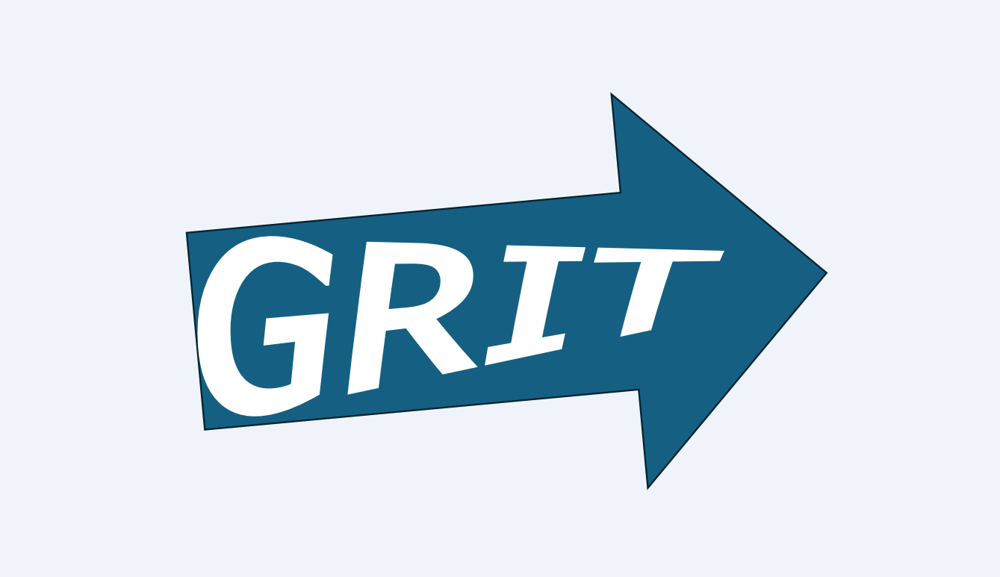

# 自己紹介

はじめまして。Tera と申します
東京通信大学情報マネジメント学部に通ってる大学生です。
大学ではプログラミング、機械学習と人工知能、データサイエンス、情報倫理、統計学といった情報分野に加え、経営学や会計学などのビジネス関連分野まで、幅広く学習しています。

# 技術スタック

## プログラミング言語

- **JavaScript**: 40%
- **Python**: 30%

## マークアップ言語

- **HTML**: 40%
- **CSS**: 40%

## 理解度の定義

- **100%**: 完全に理解し、他人に教えることができる
- **90%**: 高度なタスクをほぼ完璧にこなせる
- **80%**: 高度なタスクをこなせるが、専門的な知識が必要な場合もある
- **70%**: 応用的なタスクを問題なくこなせる
- **60%**: 応用的なタスクもある程度こなせる
- **50%**: 一般的なタスクを問題なくこなせる
- **40%**: 一般的なタスクをこなせるが、応用は難しい
- **30%**: 簡単なタスクをこなせる
- **20%**: 基本的な操作を試したことがある
- **10%**: 基本的な概念を少し知っている
- **0%**: 全く理解していない

# Todo

エンジニアの要と言えるインフラの知識が無さすぎるので Linux や AWS あたりの資格取得を目指します。
